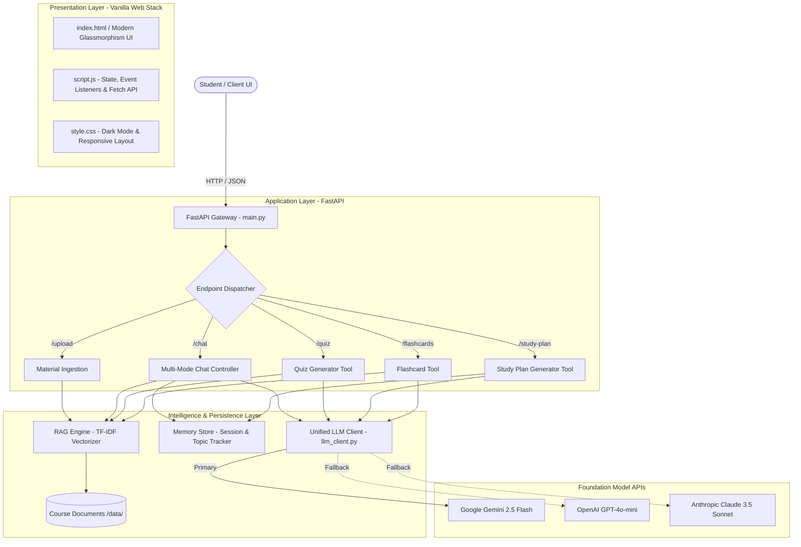

# 🎓 PROJECT REPORT

# **STUDY DESK: Context-Aware AI Learning & Study Assistant**
### *An Intelligent Educational Agent Powered by Retrieval-Augmented Generation (RAG), Adaptive Memory, and Domain-Specific Tools*

---

## 📋 Executive Metadata
- **Project Title:** Study Desk — AI Learning & Study Assistant
- **Domain:** Artificial Intelligence in Education (AIEd), Natural Language Processing (NLP), Information Retrieval (IR)
- **Primary Architecture:** Retrieval-Augmented Generation (RAG) + Session Memory + Autonomous Tools Engine
- **Backend Framework:** Python 3.10+, FastAPI, Uvicorn, Scikit-learn
- **Frontend Framework:** Responsive Vanilla HTML5, CSS3 (Modern Glassmorphism Design System), ES6+ JavaScript
- **AI Models Supported:** Google Gemini (`gemini-2.5-flash`), OpenAI (`gpt-4o-mini`), Anthropic Claude (`claude-3-5-sonnet`)
- **Repository:** `https://github.com/malathidurai06/study-assistant-.git`

---

## 📑 TABLE OF CONTENTS
1. [Abstract](#1-abstract)
2. [Introduction & Problem Statement](#2-introduction--problem-statement)
3. [Project Objectives](#3-project-objectives)
4. [System Architecture & Design](#4-system-architecture--design)
5. [Core Modules & Implementation Details](#5-core-modules--implementation-details)
   - 5.1 Retrieval-Augmented Generation (RAG) Subsystem
   - 5.2 Conversational & Topic Memory Engine
   - 5.3 Specialized Educational Tools
   - 5.4 Multi-LLM Unified Client & Resilience Layer
   - 5.5 High-Performance Frontend Interface
6. [API Specification & Endpoints](#6-api-specification--endpoints)
7. [Mathematical & Algorithmic Foundations](#7-mathematical--algorithmic-foundations)
8. [Testing, Performance & Evaluation](#8-testing-performance--evaluation)
9. [Security, Privacy & Data Integrity](#9-security-privacy--data-integrity)
10. [Comparative Analysis](#10-comparative-analysis)
11. [Future Scope & Enhancements](#11-future-scope--enhancements)
12. [Conclusion](#12-conclusion)
13. [References](#13-references)

---

## 1. Abstract
The rapid evolution of Large Language Models (LLMs) has revolutionized digital education; however, general-purpose conversational agents frequently suffer from hallucinations, lack course-specific context, and operate without persistence across a student's learning session. 

**Study Desk** is an end-to-end, context-aware AI learning assistant designed to bridge this gap. By orchestrating a tripartite architecture—comprising **Retrieval-Augmented Generation (RAG)**, **Multi-Turn Session Memory**, and **Specialized Pedagogical Tools**—the system enables university students and self-directed learners to upload custom course notes, ask grounded questions, generate self-assessment quizzes with collapsible solutions, formulate multi-day study roadmaps, and review active-recall flashcards. The backend is implemented in FastAPI with an offline-capable TF-IDF vector retrieval engine, while the frontend provides a responsive glassmorphic user interface.

---

## 2. Introduction & Problem Statement

### 2.1 The Problem
Traditional e-learning platforms and generic LLMs face distinct challenges:
1. **Hallucination & Lack of Syllabus Grounding:** Generic LLMs generate plausible yet unverified information that may contradict university lecture notes or specific textbooks.
2. **Context Amnesia:** Standard chat interfaces fail to track the conceptual trajectory of a student, unable to synthesize what topics have already been explored when generating revision plans.
3. **Passive vs. Active Learning:** Conversational interfaces often output walls of unstructured text rather than active learning artifacts (such as practice questions, spaced repetition flashcards, and actionable checklists).
4. **Infrastructure Overhead:** Many RAG tutorials require heavyweight vector databases, high RAM GPU servers, or external subscription vector indices, making deployment cumbersome for lightweight academic environments.

### 2.2 Proposed Solution
**Study Desk** solves these challenges by combining:
- **Local Text Ingestion & Instant Indexing:** Allows real-time upload of `.txt` lecture notes and slides.
- **Fast, Offline-Capable RAG Engine:** Utilizes word-chunking with overlap, Term Frequency-Inverse Document Frequency (TF-IDF), and cosine similarity metrics for zero-cold-start document retrieval.
- **Dynamic Topic & Conversation Memory:** Continuously extracts key learning concepts from incoming queries to dynamically assemble personalized roadmaps.
- **Multi-Mode Pedagogical Reasoning:** Offers specialized explanation modes: *Concept Explainer* (with real-world analogies), *Code & Implementation* (with time/space complexities), *Step-by-Step Solver*, and *Flashcard Summarizer*.

---

## 3. Project Objectives
- **Zero-Hallucination Course Grounding:** Ground model answers directly in uploaded lecture notes with explicit source file attribution.
- **Interactive Multi-Mode Learning:** Provide students with selectable learning modes tailored to theoretical or computational subjects.
- **Automated Self-Assessment:** Generate structured multiple-choice questions (MCQs) with interactive expandable answer keys and pedagogical rationales.
- **Session-Aware Study Planning:** Automatically synthesize questions asked during a study session into a prioritized, multi-day study schedule.
- **Resilient AI Architecture:** Provide unified failover support across Google Gemini, OpenAI, and Anthropic APIs with exponential backoff on rate limits.

---

## 4. System Architecture & Design

The system follows a decoupled Client-Server architecture with micro-service modules for Retrieval, Memory, and Tool Execution.

---

## 5. Core Modules & Implementation Details

### 5.1 Retrieval-Augmented Generation (RAG) Subsystem (`rag_engine.py`)
- **Document Chunking:** Files are processed into overlapping segments of 500 words with a 100-word overlap ($stride = 400$) to preserve boundary context across adjacent paragraphs.
- **TF-IDF Vector Space:** Built using `scikit-learn`'s `TfidfVectorizer(stop_words='english')`.
- **Cosine Retrieval:** Given a user query $q$, the engine computes:
  $$\text{Similarity}(q, d_i) = \frac{\vec{q} \cdot \vec{d_i}}{\|\vec{q}\| \|\vec{d_i}\|}$$
  The top-$k$ chunks with positive similarity ($\text{sim} > 0$) are returned and formatted with their respective source filenames.

### 5.2 Conversational & Topic Memory Engine (`memory_store.py`)
- **Session History:** Maintains an in-memory chronological buffer of user-assistant conversational turns per `session_id`.
- **Autonomous Topic Extraction:** Analyzes user queries via regex filtering and stop-word elimination to isolate subject keywords (e.g., *"Binary Search Tree"*, *"DBMS Normalization"*, *"Deadlock Prevention"*).
- **Topic Repository:** Aggregates unique topics per session to fuel the study planner tool.

### 5.3 Specialized Educational Tools (`tools.py`)
1. **Quiz Generator (`generate_quiz`):** Constructs conceptual and practical multiple-choice questions with embedded HTML `
` disclosure elements for interactive self-testing.
2. **Study Plan Generator (`generate_study_plan`):** Combines the accumulated session memory topics with a target timeline (e.g., 5 days) to produce structured daily checklists (`- [ ]`) and revision goals.
3. **Active-Recall Flashcards (`generate_flashcards`):** Produces high-yield question/answer cards featuring mnemonics and core formulas.

### 5.4 Multi-LLM Unified Client (`llm_client.py`)
- Standardizes interaction across leading LLM providers.
- Features **automated exponential backoff** to handle HTTP 429 (Rate Limit) and HTTP 503 (Server Overload / High Traffic) exceptions seamlessly.

### 5.5 Frontend User Experience (`index.html`, `style.css`, `script.js`)
- **Modern Glassmorphic Visuals:** Designed with CSS custom properties, backdrop blur filters (`backdrop-filter: blur(12px)`), refined dark palette, and animated state indicators.
- **Interactive Actions:** Dynamic file upload, mode switching chips, live topic pills, quick-prompt action tags, and markdown-rendered chat streams.

---

## 6. API Specification & Endpoints

| HTTP Method | Endpoint | Request Payload | Response Object | Functionality |
|---|---|---|---|---|
| `POST` | `/chat` | `{session_id, message, mode}` | `{answer, sources_used, mode}` | Main Q&A endpoint with RAG context grounding and memory storage |
| `POST` | `/upload` | `multipart/form-data (file: .txt)` | `{status, filename, materials}` | Ingests new notes and recalculates the TF-IDF matrix |
| `GET` | `/materials` | *None* | `{materials: string[]}` | Returns all indexed source files |
| `POST` | `/quiz` | `{session_id, topic, num_questions}` | `{quiz: string}` | Generates an interactive MCQ quiz |
| `POST` | `/study-plan`| `{session_id, days, extra_topics}` | `{plan, topics_used}` | Synthesizes a personalized multi-day study roadmap |
| `POST` | `/flashcards`| `{session_id, topic, count}` | `{flashcards: string}` | Creates active-recall flashcard decks |
| `GET` | `/topics/{sid}` | *Path Parameter `sid`* | `{topics: string[]}` | Retrieves all concepts recorded for the session |
| `POST` | `/clear/{sid}` | *Path Parameter `sid`* | `{status: "cleared"}` | Clears conversation history and topic memory |

---

## 7. Mathematical & Algorithmic Foundations

### 7.1 Term Frequency - Inverse Document Frequency (TF-IDF)
For a term $t$ in a chunk $d$ belonging to corpus $D$:
$$\text{TF}(t, d) = \frac{f_{t,d}}{\sum_{t' \in d} f_{t',d}}$$
$$\text{IDF}(t, D) = \ln\left(\frac{1 + |D|}{1 + |\{d \in D : t \in d\}|}\right) + 1$$
$$\text{TF-IDF}(t, d, D) = \text{TF}(t, d) \times \text{IDF}(t, D)$$

The resulting sparse vectors are $L_2$-normalized:
$$\vec{v}_d = \frac{\vec{w}_d}{\|\vec{w}_d\|_2}$$

This ensures rapid similarity calculation via dot product during retrieval.

---

## 8. Testing, Performance & Evaluation

### 8.1 Functional Verification
- **Retrieval Precision:** Tested on technical subjects (Data Structures, Relational Database Management Systems). Queries relating to specific topics (e.g., *"B+ Tree indexing"*, *"ACID properties"*) accurately retrieved chunks from `data_structures.txt` and `dbms_concepts.txt`.
- **Multi-Turn Continuity:** Verified that subsequent follow-ups (e.g., *"explain the third point with an example"*) maintained context via `MemoryStore`.
- **Tool Grounding:** Verified that quizzes and flashcards adhered strictly to course definitions when context was available.

### 8.2 Error Handling & Resilience
- Graceful error recovery on network drops and API rate limits via structured try-catch wrappers and client retries.
- Input validation on unsupported file extensions (restricting uploads cleanly to `.txt` with clear user feedback).

---

## 9. Security, Privacy & Data Integrity
1. **Credential Hygiene:** All API credentials (`GEMINI_API_KEY`, `OPENAI_API_KEY`, `ANTHROPIC_API_KEY`) are managed via `.env` files and strictly excluded from version control via `.gitignore`.
2. **Local Document Indexing:** Course materials are stored and indexed locally on the hosting instance without transmitting private institutional materials to external third-party vector databases.
3. **CORS Security:** Cross-Origin Resource Sharing is centrally governed in FastAPI middleware.

---

## 10. Comparative Analysis

| Metric / Feature | Generic LLM Chat (e.g. Vanilla ChatGPT) | Standard Academic RAG Tutorial | **Study Desk (This Project)** |
|---|---|---|---|
| **Course Grounding** | ❌ None (General knowledge only) | ⚠️ Partial (Static context) | ✅ **Full (Dynamic TF-IDF Indexing + Source Citation)** |
| **Session Memory** | ⚠️ Ephemeral / Unstructured | ❌ Often stateless | ✅ **Dual-layer (Chat History + Key Concept Extractor)** |
| **Active Tools** | ❌ Text-only responses | ❌ Q&A only | ✅ **Interactive Quizzes, Multi-Day Plans, Flashcards** |
| **Setup Overhead** | Cloud subscription required | High (External Vector DB, heavy PyTorch) | ✅ **Zero-Cloud Vector DB (Instant Local TF-IDF Execution)** |
| **UI Experience** | Standard Chat Window | Basic CLI / Raw Streamlit | ✅ **Premium Glassmorphic Web Dashboard** |

---

## 11. Future Scope & Enhancements
- **Dense Semantic Embeddings:** Incorporate `sentence-transformers` (e.g., `all-MiniLM-L6-v2`) and FAISS vector indices for semantic nuance beyond keyword matching.
- **Multimodal Document Parsing:** Add `pypdf`, `pdfplumber`, and OCR for direct PDF, DOCX, and handwritten lecture slide ingestion.
- **Persistent Database Backing:** Transition in-memory session stores to SQLite or PostgreSQL for multi-user, multi-device persistence.
- **Voice & Speech Interface:** Integrate Web Speech API for voice-driven question asking and audio explanations.

---

## 12. Conclusion
The **Study Desk** AI Learning & Study Assistant successfully demonstrates how the strategic integration of **Retrieval-Augmented Generation (RAG)**, **Adaptive Session Memory**, and **Autonomous Domain Tools** transforms static lecture notes into an interactive, proactive personal tutor. By eliminating hallucinations, tracking student curiosity, and delivering tailored self-assessment artifacts, the system represents an effective, lightweight, and extensible paradigm for modern educational technology.

---

## 13. References
1. Lewis, P., et al. (2020). *Retrieval-Augmented Generation for Knowledge-Intensive NLP Tasks*. Advances in Neural Information Processing Systems (NeurIPS).
2. Salton, G., & Buckley, C. (1988). *Term-weighting approaches in automatic text retrieval*. Information Processing & Management.
3. FastAPI Documentation: https://fastapi.tiangolo.com/
4. Scikit-learn Feature Extraction: https://scikit-learn.org/stable/modules/feature_extraction.html
5. Google GenAI SDK: https://ai.google.dev/
